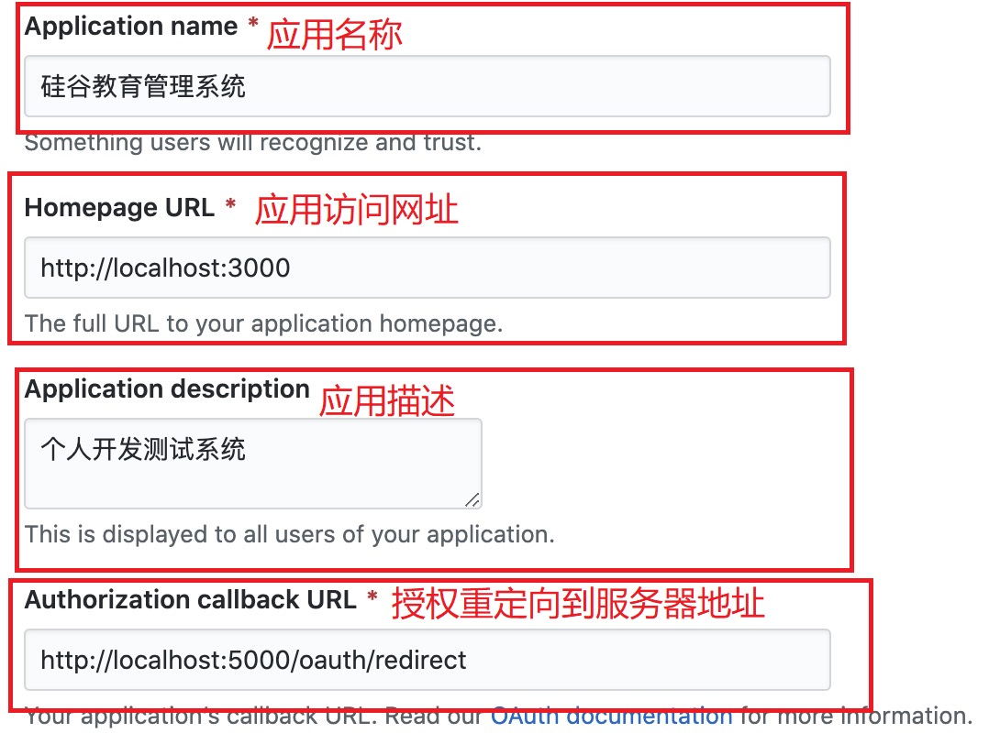
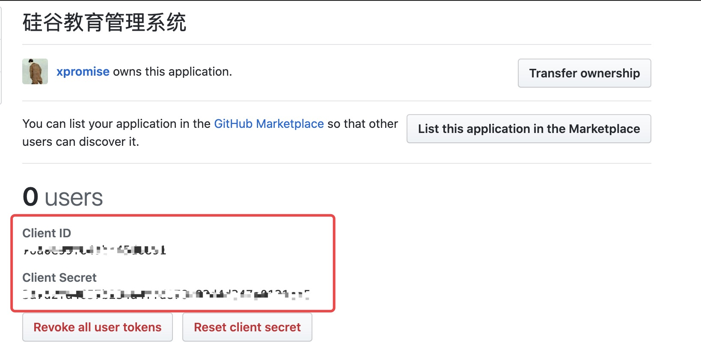

## 1、 OAuth 2.0

- OAuth 2.0 是目前最流行的授权机制，用来授权第三方应用，获取用户数据。
- 简单说，OAuth 就是一种授权机制。数据的所有者告诉系统，同意授权第三方应用进入系统，获取这些数据。系统从而产生一个短期的进入令牌（token），用来代替密码，供第三方应用使用。

- 文档： https://developer.github.com/apps/building-oauth-apps/authorizing-oauth-apps/ （需翻墙）
- 教程： http://www.ruanyifeng.com/blog/2019/04/github-oauth.html

## 2、示例： 使用 github 登录你的网址

- 开发流程介绍

  - A 网站让用户跳转到 GitHub。
  - GitHub 要求用户登录，
  - GitHub 询问"A 网站要求获得 xx 权限，你是否同意？"
  - 用户同意，GitHub 就会重定向回 A 网站，同时发回一个授权码。
  - A 网站使用授权码，向 GitHub 请求令牌。
  - GitHub 返回令牌. A 网站使用令牌，向 GitHub 请求用户数据。

- 应用登记

  - 一个应用要求 OAuth 授权，必须先到对方网站登记，让对方知道是谁在请求。
  - https://github.com/settings/applications/new

- github oauth 2.0 文档
  - https://developer.github.com/apps/building-oauth-apps/authorizing-oauth-apps/

## 3、使用

1. 进行 github 应用登记
   登记地址：https://github.com/settings/applications/new
   
2. 登记成功，得到 client_id
   查看地址：https://github.com/settings/developers
   
3. 将得到的 client_id 存到项目 config/oauth.js 中

```js
// github验证后返回的id
const client_id = "xxxx";
// oauth验证网址
const auth_url = "https://github.com/login/oauth/authorize";
// 授权后验证地址(和github填写一致)
const redirect_url = "http://localhost:5000/oauth/redirect";

export { client_id, auth_url, redirect_url };
```

4. 新增模块 pages/Login/components/Oauth

```jsx
import React, { Component } from "react";
import { connect } from "react-redux";
import { loginSuccessSync } from "@redux/actions/login";

@connect(null, { loginSuccessSync })
class Oauth extends Component {
	componentDidMount() {
		// 获取token --> 此时服务器已经获取到github用户数据，并注册了用户，返回token
		const token = this.props.location.search.split("=")[1];
		// 更新redux token
		this.props.loginSuccessSync({ token });
		// 保存到本地
		localStorage.setItem("user_token", token);
		// 跳转到首页
		this.props.history.replace("/");
	}

	render() {
		return <div>权限验证中。。。</div>;
	}
}
export default Oauth;
```

5. 点击 github 登陆，触发 oauth 授权登陆

```jsx
<GithubOutlined className="login-icon" onClick={this.loginGithub} />;

loginGithub = () => {
	window.location.href = `${auth_url}?client_id=${client_id}&redirect_uri=${redirect_url}`;
};
```
